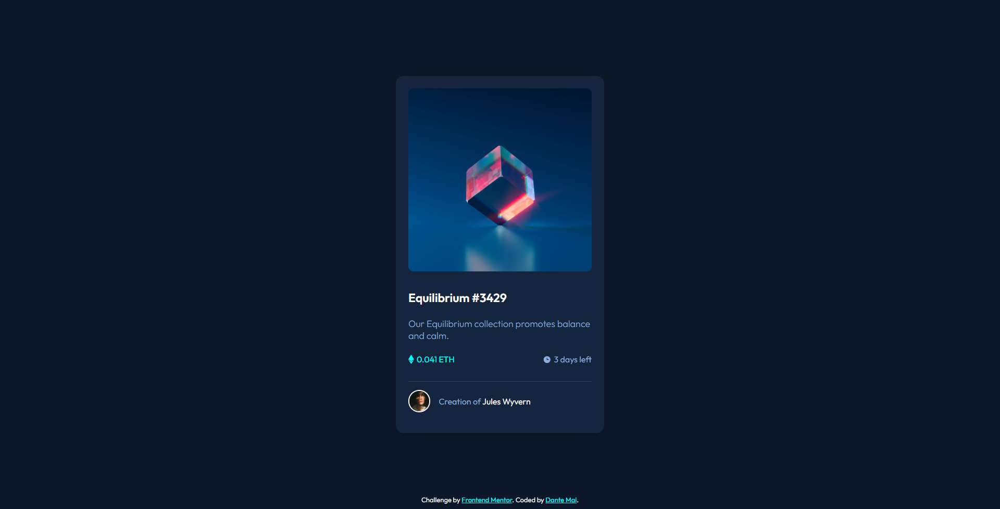
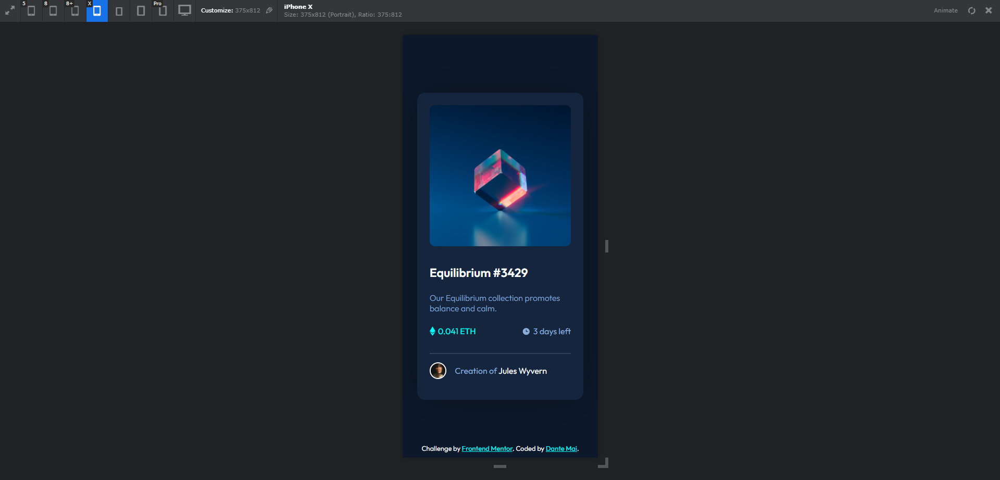

# Frontend Mentor - NFT preview card component solution

This is a solution to the [NFT preview card component challenge on Frontend Mentor](https://www.frontendmentor.io/challenges/nft-preview-card-component-SbdUL_w0U). Frontend Mentor challenges help you improve your coding skills by building realistic projects. 

## Table of contents

- [Overview](#overview)
  - [The challenge](#the-challenge)
  - [Screenshot](#screenshot)
  - [Links](#links)
- [My process](#my-process)
  - [Built with](#built-with)
  - [What I learned](#what-i-learned)
  - [Continued development](#continued-development)
- [Author](#author)

## Overview

### The challenge

Users should be able to:

- View the optimal layout depending on their device's screen size
- See hover states for interactive elements

### Screenshot

Desktop version

Mobile version

### Links

- Solution URL: [Add solution URL here](https://github.com/se64vet/-UI-practice---NFT-preview-card-component)
- Live Site URL: [Add live site URL here](https://se64vet.github.io/-UI-practice---NFT-preview-card-component/)

## My process

### Built with

- Semantic HTML5 markup
- CSS custom properties
- Flexbox
- CSS Grid
- Mobile-first workflow

### What I learned

- Css property: aspect-ratio

## Author

- Website - [Dante Mai - Designer / Developer ](https://www.dantemai.com)
- Frontend Mentor - [@se64vet](https://www.frontendmentor.io/profile/se64vet)

